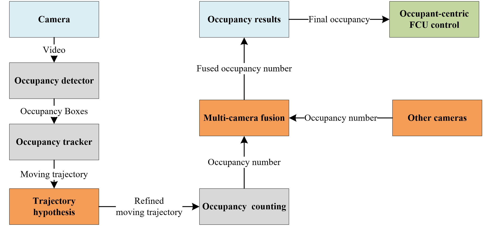
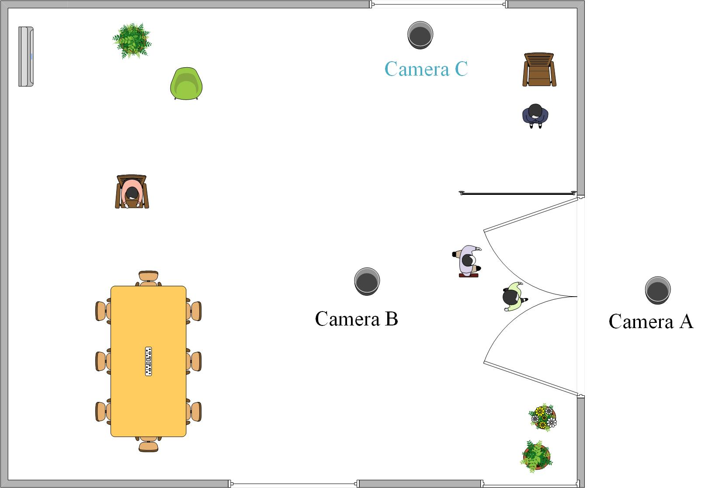
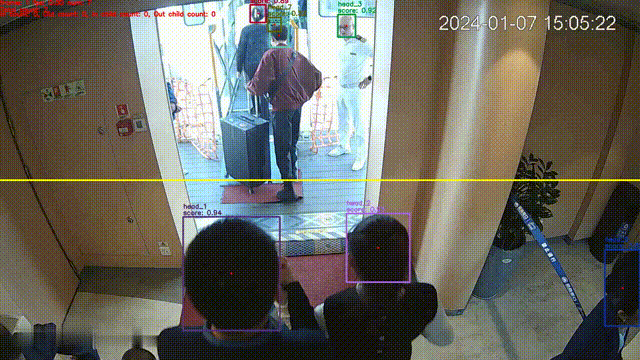

# [High-accuracy occupancy counting at crowded entrances for smart buildings](https://www.sciencedirect.com/science/article/pii/S037877882400625X)


 
 
[Paper](https://www.sciencedirect.com/science/article/pii/S037877882400625X)

## Environment
- The code is tested on Ubuntu 20.04.2, python 3.8, cuda 11.1.
- The code is tested on Windows 10, python 3.8, cuda 11.1.


## Installation

Please refer to [Installation]((https://github.com/PaddlePaddle/PaddleDetection/blob/release/2.6/docs/tutorials/INSTALL_cn.md) for installation instructions for Paddle and PaddleDet. It is recommanded to install PaddleDet with pip3.

 1. Clone this repository
  ```bash
  git clone https://github.com/kailaisun/Head-tracking-for-occupancy-counting
  ```

2. Replace all files
   e.g., replace infer_cfg_pphuman.yml in the deploy\pipeline\config.
   replace cfg_utils.py in the deploy\pipeline.
   add pipeline_3.py in the deploy\pipeline.

3. Download trained  [models](https://cloud.tsinghua.edu.cn/d/c12f31ff76294990b654/)
   replace the deploy\pipeline\models folder.


## Dataset Example

  


The perspectives of the three images are outdoors, indoors, and side view, corresponding to positions A, B, and C in the layout below：

 


## Test 

An example video is uploaded, you can test our method with the following order. You can also infer other videos by change the video_file root.

```Bash
python deploy/pipeline/pipeline_3.py --config deploy/pipeline/config/infer_cfg_pphuman.yml --video_file example.mp4 --device gpu --do_entrance_counting --draw_center_traj --child True
```

The infer result of example video is shown below:




## Citation

```
@article{SUN2024114509,
         title = {High-accuracy occupancy counting at crowded entrances for smart buildings},
         journal = {Energy and Buildings},
         volume = {319},
         pages = {114509},
         year = {2024},
         issn = {0378-7788},
         doi = {https://doi.org/10.1016/j.enbuild.2024.114509},
         author = {Kailai Sun and Xinwei Wang and Tian Xing and Shaobo Liu and Qianchuan Zhao}
}
```


## License

The repository is licensed under the [Apache 2.0 license](LICENSE).

## Contact Us

If you have other questions❓, please contact us in time 👬
